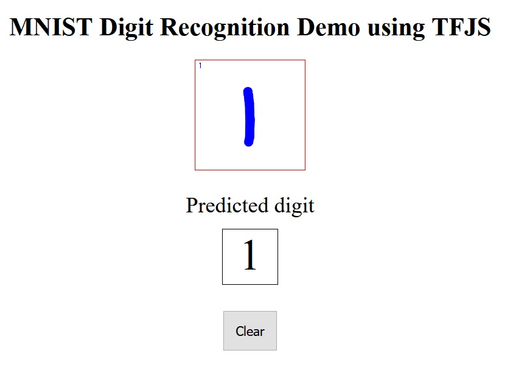

## Tensorflow JS Canvas Drawing Digit Prediction
Convert a keras model to tfjs and host it using git pages.  
Users who connect to the static web site can draw images of digits and see classification results.


## Draw, Play and Classify
https://sv-v5.github.io/tfjs-digit-canvas  
[](https://sv-v5.github.io/tfjs-digit-canvas)

## Notes
There is no backend code running calculations for predictions.  
The model is loaded in each user's browser and prediction calculations are done with javascript locally by the user.

```js
    tf.loadLayersModel('model/model.json').then(function(model) {
      window.model = model;
    });

    ...
    window.model.predict([tf.tensor(input).reshape([1, 28, 28, 1])])
```


## Credits
https://github.com/carlos-aguayo/carlos-aguayo.github.io for the git pages example  
https://keras.io/api/datasets/mnist/ MNIST digits dataset  
https://www.html5canvastutorials.com/labs/html5-canvas-paint-application/ for a canvas drawing example  
http://bencentra.com/code/2014/12/05/html5-canvas-touch-events.html for touch events on mobile browsers  
